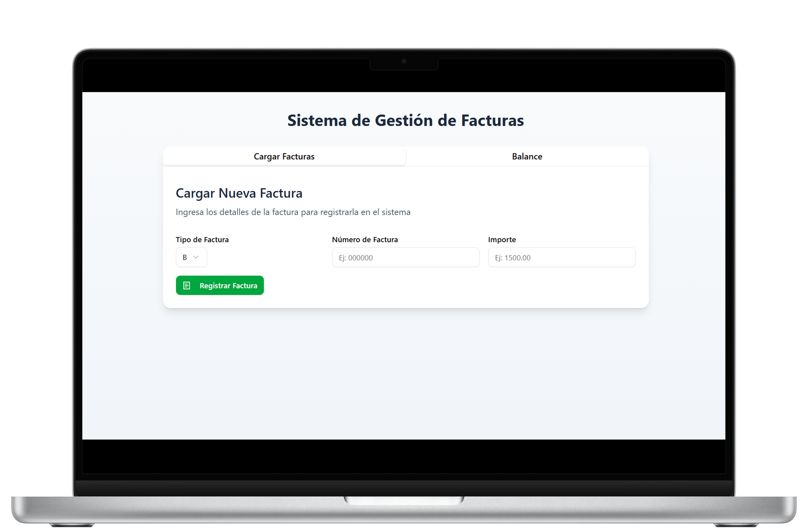
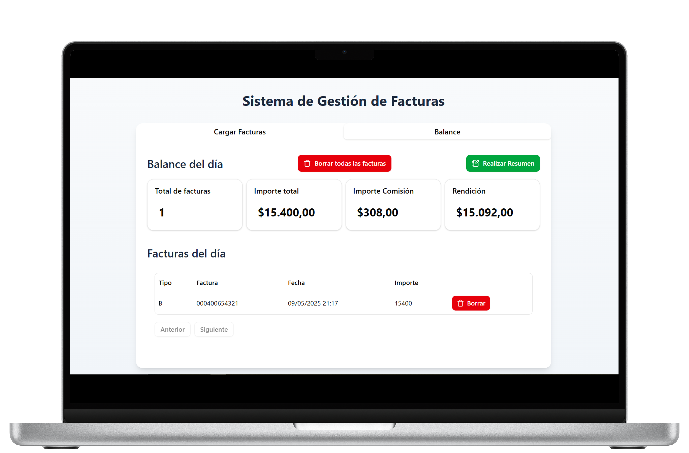

# 💧 Sistema de Gestión de Facturas - Potabilizadora

**SIFacturaAguaPWA** es una aplicación web progresiva (PWA) desarrollada con **React**, **TypeScript**, **TailwindCSS** y **Vite**, pensada para gestionar facturas de una potabilizadora de agua. Permite registrar fácilmente facturas, visualizar balances diarios, aplicar comisiones automáticas del 2%, descargar los registros en PDF y mucho más.

---

## 🚀 Tecnologías utilizadas

| Tecnología | Descripción |
|-----------|-------------|
| [React](https://reactjs.org) | Biblioteca de UI |
| [Vite]([https://vite.dev/]) | Framework para desarrollo web moderno |
| [Tailwind CSS](https://tailwindcss.com) | Estilos rápidos y personalizables |
| [TypeScript](https://www.typescriptlang.org) | Tipado estático para mayor robustez |
| [Dexie.js](https://dexie.org) | IndexedDB para almacenamiento offline |
| [Zod](https://github.com/colinhacks/zod) | Validación de esquemas de datos |
| [React Hook Form](https://react-hook-form.com) | Manejo eficiente de formularios |
| [jsPDF](https://github.com/parallax/jsPDF) + AutoTable | Generación de archivos PDF |
| [Radix UI](https://www.radix-ui.com/) | Componentes accesibles y estilizados |

---

## 📦 Funcionalidades principales

- ✔️ Registro manual de facturas con tipo, número e importe.
- 📆 Balance del día con total, comisión (2%) y rendición automática.
- 🧾 Descarga en PDF de todas las facturas registradas.
- 🧠 Datos persistentes gracias a almacenamiento local (IndexedDB).
- 🧩 Interfaz limpia, responsive y de carga rápida.
- 🟢 PWA: puede instalarse como una app en el dispositivo.

---

## 🖼️ Capturas

### Registro de Factura


### Balance Diario


---

## 🛠️ Instalación y uso local

1. Clonar el repositorio:

```bash
git clone https://github.com/DevEmpulse/SI-cobro-agua.git
cd SI-cobro-agua
```

2. Instalar dependencias:

```bash
npm install
```

3. Iniciar la app en desarrollo:

```bash
npm run dev
```

---

## 🗂️ Estructura de carpetas

```bash
📦 SI-COBRO-AGUA
├── 📁 public
│   └── vite.svg
├── 📁 src
│   ├── 📁 assets
│   │   └── react.svg
│   ├── 📁 components
│   │   ├── 📁 DataTable
│   │   │   └── DataTable.tsx
│   │   ├── 📁 ui
│   │   │   ├── button.tsx
│   │   │   ├── card.tsx
│   │   │   ├── dialog.tsx
│   │   │   ├── form.tsx
│   │   │   ├── input.tsx
│   │   │   ├── label.tsx
│   │   │   ├── popover.tsx
│   │   │   ├── select.tsx
│   │   │   ├── sonner.tsx
│   │   │   ├── table.tsx
│   │   │   ├── tabs.tsx
│   │   │   ├── ActionsCell.tsx
│   │   │   ├── ConfirmDeleteModal.tsx
│   │   │   └── Header.tsx
│   ├── 📁 db
│   │   └── facturasDB.ts
│   ├── 📁 features
│   │   └── 📁 facturas
│   │       ├── 📁 columns
│   │       │   ├── Columns.tsx
│   │       │   └── exportarFacturas.ts
│   │       ├── FacturaForm.tsx
│   │       └── FacturaList.tsx
│   ├── 📁 hooks
│   │   ├── useBalance.tsx
│   │   └── useFacturas.tsx
│   ├── 📁 lib
│   │   └── utils.ts
│   ├── 📁 pages
│   │   ├── Balance.tsx
│   │   └── Home.tsx
│   ├── 📁 types
│   │   ├── balance.ts
│   │   ├── factura.ts
│   │   └── react-table.d.ts
│   ├── 📁 utils
│   │   ├── calculos.ts
│   │   └── deletefactura.ts
│   ├── App.css
│   ├── App.tsx
│   ├── index.css
│   ├── main.tsx
│   └── vite-env.d.ts
├── .gitignore
├── components.json
├── eslint.config.js
├── index.html
├── package-lock.json
├── package.json
├── README.md
├── tailwind.config.ts
├── tsconfig.app.json
├── tsconfig.json
├── tsconfig.node.json
└── vite.config.ts
```

---

## 📦 Deploy

Esta aplicación está desplegada en [Netlify](https://www.netlify.com/) como una PWA completamente funcional, lista para ser usada sin conexión.

---

## 📃 Licencia

MIT © 2025 - Empulse.site
